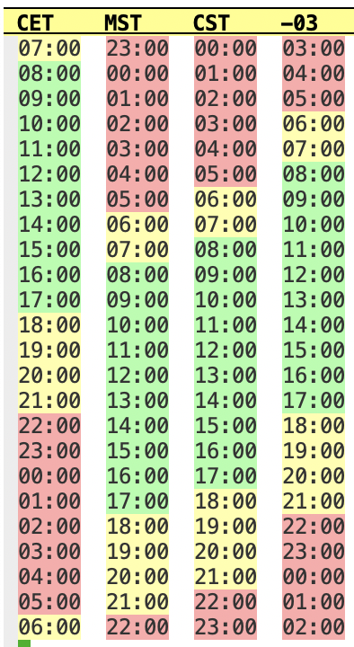

# Time-table: Compare the hours of various time-zones with ease

## Installation

Currently you must install this manually by including time-table.el in your load path and calling `(require 'time-table')`.  Hopefully this will be included on MELPA at a later time.

## Usage

Run `M-x time-table RET` to open the time table buffer.  The buffer will start with your current time zone and any time-zones listed in the `time-table-default-time-zones` custom variable.  You can use the following commands while viewing this buffer:

- `a`: add a new time zone to the table.
- `c`: center the tables on the column where the point is located.
- `x`: delete the column where the point is located.

## Customization

- `time-table-default-time-zones`: A list of time-zone name strings to start with in the table, in addition to the current time zone.
- `time-table-good-time-interval`: A list of 2 numbers representing the interval which is indicated by green in the table. By default the hours 08:00 to 17:00 are marked such.
- `time-table-warning-time-interval`: A list of 2 numbers representing the interval which is indicated by yellow. This interval will be larger than the "good" interval. By default it is `(6 21)'`.
